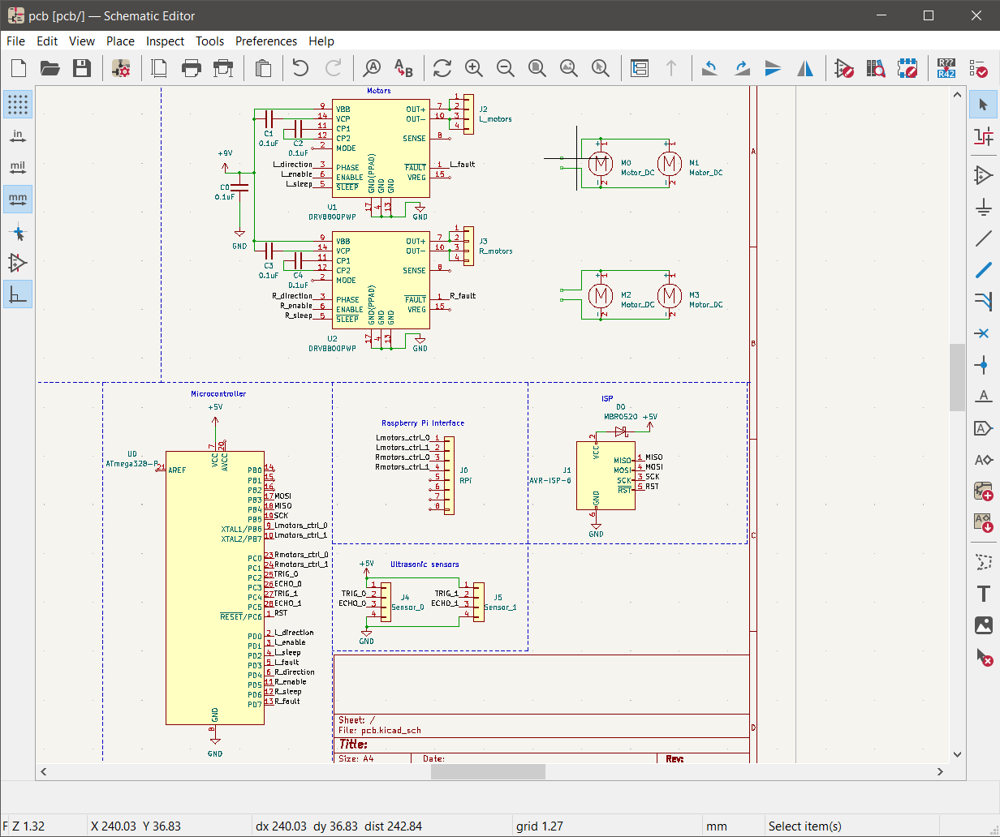
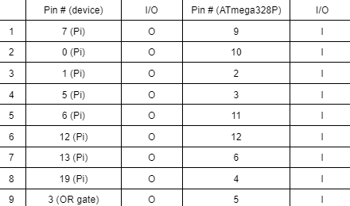
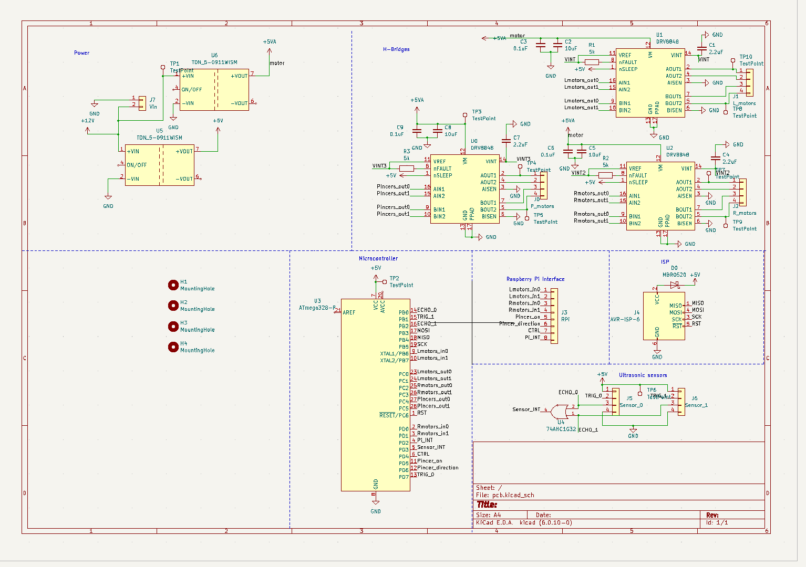
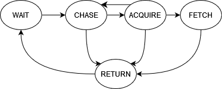
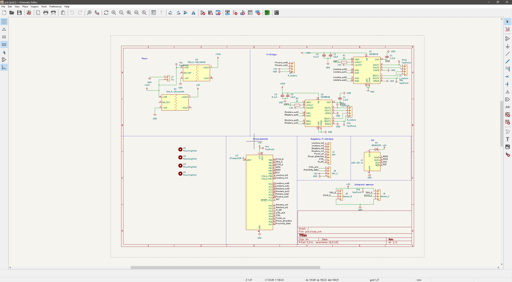
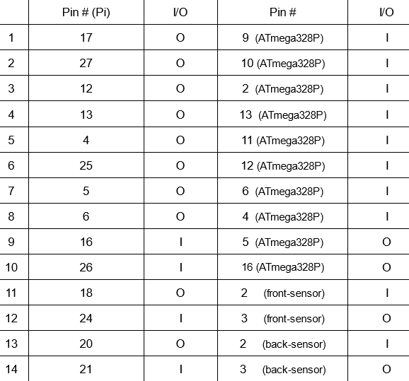
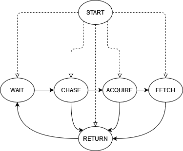
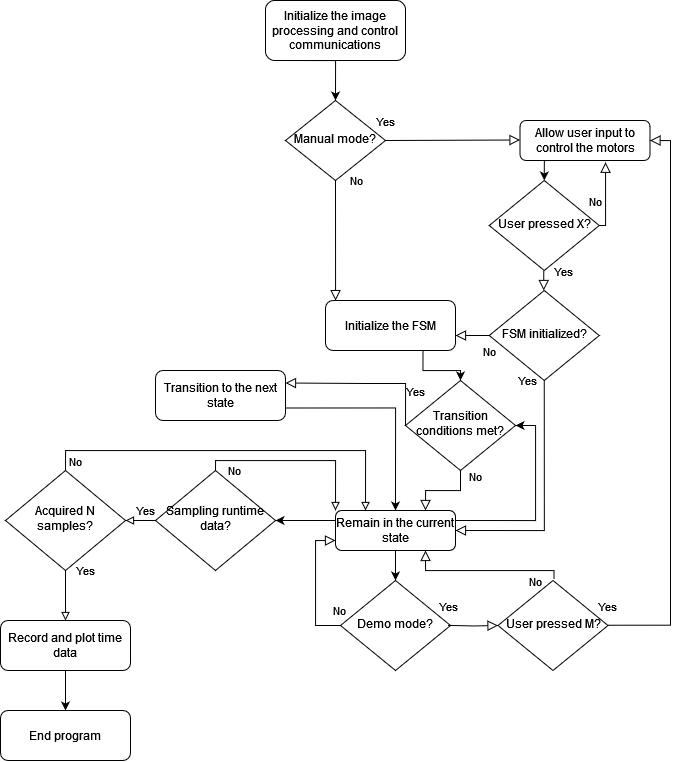
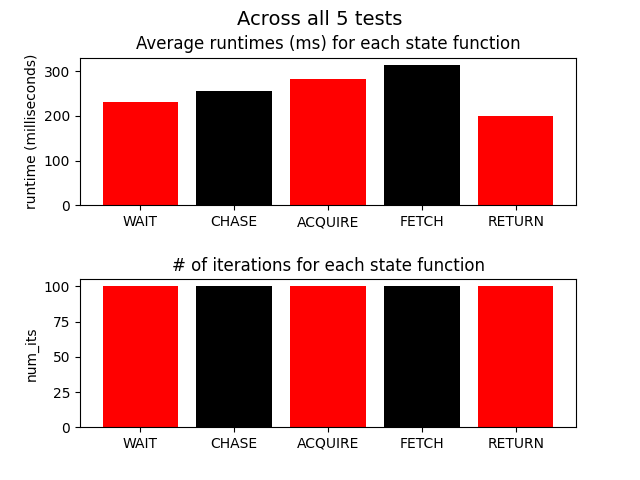

# Luis Notebook

# Table of contents
- [2023-02-14](#2023-02-14---initial-pcb-design)
- [2023-02-26](#2023-02-26---re-evaluating-the-power-subsystem)
- [2023-03-02](#2023-03-02---pcb-redesign-1)
- [2023-03-05](#2023-03-0506---buck-converters-for-power-subsystem)
- [2023-03-06](#2023-03-0506---buck-converters-for-power-subsystem)
- [2023-03-13](#2023-03-13---fetching-subsystem-rough-draft)
- [2023-03-15](#2023-03-15---microcontroller-code-rough-draft)
- [2023-03-29](#2023-03-29---image-processing-update)
- [2023-04-01](#2023-04-01---parallelization)
- [2023-04-04](#2023-04-04---pcb-redesign-2)
- [2023-04-16](#2023-04-16---working-software-demo)

# 2023-02-14 - Initial PCB design

We've set up what is expected to be the base of the final version of the PCB. We still need to decide on the power supply that we're going to use, and how we should connect it to the rest of the design. For now, our best idea for the power subsystem is to connect a high-voltage battery to the design with resistors to control the power supplied to each component.

# 2023-02-26 - Re-evaluating the power subsystem

Due to conflicting research data, we'll have to test our design's motors ourselves. With the data we've acquired beforehand, its hard to know for sure if the car we bought will be powerful enough to move under the weight of the full design. Also, we need to know how much power will be consumed at different weights.

It looks like the motors can be relied upon to handle about 0.8kg with a power supply of 6V-9V, but we need to rethink how we're actually going to connect the power supply to the rest of the design. The motors in particular would cause way too many fluctuations in the current, and a slowly decreasing voltage would make the behavior of the power subsystem even less predictable. Additionally, the design would slow down over time as the battery loses power, making the design inconvenient for long-term use. We have changed the power subsystem to use one power supply for the Pi (5V, 3A, 5Ah), and another for the PCB/motors. The second battery (11.1V, 9A, 5.2Ah) and we're going to use 2 buck converters to keep the voltage at the motors and PCB at about 5V with a maximum total current of about 2A. 

With this setup, we expect the Pi battery to last for roughly 5x5/(3x5) = 1.66 hours with its expected power consumption of about 5x3 = 15W. We expect the PCB battery to last for roughly 5.2x11.1/(2x5) = 5.77 hours with its expected maximum power consumption of 2x5 = 10W.

# 2023-03-02 - PCB redesign 1

We need to review our PCB to make sure that the control and fetching subsystems can communicate with each other and the ultrasonic sensors asynchronously without using extra resources. Also, we need to establish the mappings of the fetching subsystem's outputs to the control subsystem. 

Our design wasn't making use of the interrupt pins on the microcontroller. We've added an interrupt for the Pi and an interrupt for the ultrasonic sensors. We don't know if the sensor interrupt will be helpful because we don't know how long they will take to respond with data after being triggered. We've decided to keep the interrupt for now as a precaution. The Pi interrupt will be necessary if we want the microcontroller read the Pi input as a byte of data. Using interrupts will also prevent us from using unnecessary resources on polling all of the input pins on each iteration of the main loop for the microcontroller code. The Pi's output will consist of 2 bits per pair of motors, 1 bit to tell the control subsystem whether the design is in manual or auto control mode, and another bit to generate the microcontroller interrupt to read data from the Pi. The Pi's inputs to the microcontroller will be mapped as shown below:

The row 1 mapping will communicate the direction of the left motors, row 2 will communicate whether the left motors should be moving or not. Rows 3 and 4 will communicate the direction and movement, repectively, of the right motors. Rows 5 and 6 will communicate the movement and direction, respectively, of the pincer motors. Row 7 will communicate the information about the control state (manual or auto mode). Row 8 will communicate the Pi interrupt to the microcontroller to read the input data from the Pi. Row 9 will communicate the sensor interrupt to the microcontroller through an OR gate. The outputs of both of the sensors will be the inputs to the OR gate.

Also, we'll have to use different H-bridges if we want to free up enough pins on the microcontroller to be able to include the Pi inputs and the sensor inputs. We've decided to test the power consumption of the motors and make sure that the buck converters will be able to supply enough power. All of the new components are shown in the PCB design sheet below:

[new_H-bridges](https://www.ti.com/lit/ds/symlink/drv8848.pdf?ts=1682705623106&ref_url=https%253A%252F%252Fwww.ti.com%252Fproduct%252FDRV8848)
[buck-converters](https://www.tracopower.com/sites/default/files/products/datasheets/tdn5wism_datasheet.pdf)

# 2023-03-05/06 - Testing power consumption for buck converters

We're testing the power consumption of the motors under weights of up to 1.3kg. We need to know if our new approach with the Pi battery and the PCB/motors battery combined with buck converters will be able to provide a sufficient power supply to move the design and power the PCB components at maximum power consumption for up to 45 minutes. 

The car motors can move at a moderate speed while carrying 1.3kg and with a supply voltage of 5V at 0.7A. We expect the pincer motors and the rest of the PCB to consume no more than 1A at any given point in time. So if we convert the supply voltage down to 5V and use 2 buck converters with a current capacity of about 1A each, we whould be able to run the design with maximum power consumption for about 11.1x5.2/(5x1.7) = 6.8 hours.

# 2023-03-13 - Fetching subsystem rough draft

We need to get started on the code base for the fetching subsystem. Since the image processing code is unavailable, we'll also have to implement some way to simulate an input from the image processing code.

The structure for the fetching subsystem has been implemented using a state machine library found online called 'pystatemachine'. The state machine is initialized by defining an object from the 'FSM' class, which then initializes a parent class called 'StateLogic'. The 'FSM' class defines all of state objects and functions called when the conditions for a state transition are satisfied. The 'StateLogic' class defines the functions which dictate the design's behavior in each state. Both of these classes are implemented in state_machine.py, and the 'FSM' class uses the pystatemachine library. All functions directly involved in the handling of the fetching subsystem's output to the control subsystem are implemented in a class called 'control' in gpio.py. In order to run/debug the fetching subsystem, we've implemented functions in img_proc.py that generate a random output in the format of the expected output from the image processing code. Once the image processing code is ready, calls to these functions will be replaced with calls to their counterparts in the image processing code. The FSM has a total of 6 states, and the state machine diagram is shown below:

[pystatemachine](https://pypi.org/project/pystatemachine/#:~:text=pystatemachine%20is%20a%20versatile%2C%20yet%20easy-to-use%20finite-state%20machine,another%20when%20initiated%20by%20a%20triggering%20event.%20Usage)

# 2023-03-15 - Microcontroller code rough draft

In preparation for the hardware integration, we should have a code base that sets up and implements the interrupt handlers for the Pi and sensor interrupts, and uses this input data to define the necessary outputs to the motors.

A rough draft of the microcontroller code has been implemented. The input and output pins are all defined as specified on the PCB design document and the mapping shown in [2023-03-02](#2023-03-02---pcb-redesign-1), and logic has been implemented to interpret inputs from the sensors/Pi into commands for the motors. Unfortunately, we won't be able to test this code until the hardware is ready. Also, some research suggests that the delay on the response of the ultrasonic sensors is shorter than we anticipated when we reserved an interrupt pin for the ultrasonic sensors on the microcontroller. It looks like we might not need the sensor interrupt. According to the datasheet, the HC-SR04 provides accuracy acceptable for our project up to about 400cm away, meaning the maximum delay we could expect to experience for our purposes is about (400x2/34300)x1000 = 23ms. Although this is long in terms of the rest of the operations handled by the microcontroller, it is short enough to allow he sensors to be sampled at least 4 times before a single loop of the fetching subsystem completes (recall the minimum expected runtime of 100ms for the fetching subsystem).

[HC-SR04_datasheet](https://cdn.sparkfun.com/datasheets/Sensors/Proximity/HCSR04.pdf)

# 2023-03-29 - Image processing update

Now that we have the image processing code, we need to update the fetching subsystem to use the new functions instead of the randomized ones. Since we have a program built in to measure the runtimes of the state functions using the randomized functions, it should be easy to measure the average runtimes of each of the state functions using the image processing code once they've replaced the randomized functions.

The image processing code has been integrated into the rough draft, but it looks like we'll have to get rid of the runtime sampling program and re-implement it with the image processing code. If the tests were to be run manually by us rather than the computer, it would take much longer to get enough samples for each state function in the state machine. Now that the image processing is integrated, we should start focusing on how our code will handle state changes that require the state machine to wait for an unknown amount of time. This will mainly be a concern in the transition cases of the ACQUIRE and FETCH states, both of which demand that the software gives the pincers enough time to close or open.

# 2023-04-01 - Parallelization

The frame rate of the image processing code is somewhat low. Our goal is to parallelize this part of the code somehow so in order to get a more acceptable framerate without sacrificing too much of the runtime for the fetching subsystem. 

We've implemented multithreading so that the main thread can continue to execute the rest of the software flowchart while the camera thread reads data from the camera. It looks like this doesn't change the performance much on our home computers, but we'll have to see if it improves the runtime at all on the Raspberry Pi. We've made an attempt to execute the image processing as a parallel process, but the program's heavy reliance upon interrupt logic in a sequential context adds the challenge of process synchronization to the software design. Since there are more immediate concerns for the software at the moment, such as synchronizing with the microcontroller, we should put further work regarding parallelization on hold until we've successfully integrated everyone's parts of the project. At the moment, the sequential code runs at a consistent 5 FPS, which is already above the proposed minimum 2 FPS.

# 2023-04-04 - PCB redesign 2

While setting up the code base for the microcontroller, we found that the interrupt for the ultrasonic sensors had no practical value. Also, we found that we could free a pin on the microcontroller if we eliminated a redundant second trigger for the ultrasonic sensors and had one trigger that activated both sensors at once. Our goal is to find out how we should repurpose these two pins on the microcontroller.

We've decided to repurpose both pins as outputs from the microcontroller to the Pi. The first will be used to tell the Pi when the microcontroller is ready to accept a new input from the Pi, and it will also be used to record the approximate runtime of the code in the microcontroller's main loop. The second will be used to tell the Pi when an object is within a certain distance from the sensors. The output will be 1 if something is within range, and 0 else.

# 2023-04-16 - Working software demo

We need to have a user interface that makes it easier for us to test and debug our integrated design. The interface should explain how to use manual control mode, and the user should be able to toggle printing, runtime data collection, whether the design boots in demo mode (shows the camera view on the screen) or not, whether the design boots in manual control mode or not, and which state the FSM (auto mode only) is initialized to through the command line.

We've implemented all of the features described above, along with a means of manually generating the SIGUSR1 and SIGUSR2 signals to partially simulate an input to the Pi from the microcontroller. With this, we should be able to demonstrate full functionality of the fetching subsystem and collect data for validation, even if we are unable to successfully integrate the components of the design.

NOTE: Regarding the partial SIGUSR1 and SIGUSR2 simulation. In the final design, the microcontroller can generate interrupts completely asynchronously. The simulation of these signals via manual input fails to account for this by only raising the signals when certain condition is met within the predefined context of the fetching subsystem's code. Therefore, extra measures may have to be taken to properly handle these signals in the final design.

# 2023-04-21 - Power subsystem failure

The group member in charge of the power subsystem encountered unexpected issues with the buck converters that we planned to use to connect the power supply to the PCB. Since we can't find an explanation as to why these issues were encountered, we'll have to find another way to power the PCB.

For now, we've decided to connect a 5V, 5000mAh battery (not the PiSugar battery) to the PCB for power. We're still experiencing issues with the motors, and we've discovered that this is mainly due to the fact that the input from the Pi to the microcontroller is always 1 at the pin that decides whether or not the right motors move. We've decided to get rid of one of the ultrasonic sensors on the PCB in order to secure the extra pin needed to control the motors.

# 2023-04-23 - Increasing horizontal granularity of the image processing output

We've decided to split the team's work into fixing the malfunctioning power/control subsystems and improving the fetching subsystem so that less debugging will be necessary once the power/control subsytems are operational. The current code tracks the goal by maintaining temporal data about a goal's position in one of 6 equal-size regions of the screen, where there are three regions in the horizontal direction and 2 in the vertical direction. We believe that increasing the granularity to 9 regions in the horizontal direction and 2 in the vertical direction will help us define the exact cases in which certain actions should be taken more thoroughly, allowing the design to move more precisely as it maneuvers towards its current goal.

We've found that increasing the granularity from 6 regions to 18 regions increases the runtime-per-loop of each state function to be >800ms. This produces a frame rate of less than 2 FPS, which is the proposed minimum frame rate. So we will not be able to use this increased granularity in the final version of the design.

# 2023-04-24 - Motor and Battery Issues

We're struggling to fix the motors. We know that signals from the Pi are being sent correctly, and we've determined that the output behavior of the H-bridges is not as expected. Also, we've found that powering the design with 2 separate batteries introduces unexpected complexity. Since we don't have the time or resources to resolve this issue, we've decided to power the entire design with the PiSugar 5V, 3A, 5Ah battery. If the PCB draws about 2A total when the design software is running, and the Pi draws the expected current of about 3A, then the design should still be able to operate at maximum power consumption for almost exactly 1 hour, which is still more than the goal of 45 minutes. However, it is important to note that this new setup puts enough strain on the battery for the voltage to drop by about 0.5V when moving the motors. 

We've talked with a TA, and it was recommended that we use PWM signals to drive the motors instead of the digital signals we've been using so far. The motors seem to be fully operational now, so we should be able to start debugging the sensor subsystem tomorrow. 

While we were trying to solve the issues with the motors, we remapped the GPIO pins used on the Pi out of concern that some of the GPIO pins may have been broken. We also decided to an ultrasonic sensor (HC-SR04) to the front and back of the car in order to detect obstacles and avoid collisions. The new pin mappings are shown in the chart below.

# 2023-04-25 - Demo version of the design

The data from the ultrasonic sensors is remarkably less reliable than we initially expected. Our goals for today are to find out why the data seems so inconsistent and to find a way to read from the sensors in a way that is reliable enough for the output data to be used as a final decision-maker by the fetching subsystem about whether or not to close the pincers and start to travel towards the user. 

We've discovered that the ultrasonic sensors can't locate the tennis ball accurately because it absorbs sound, making it seem as though any waves that came in contact with it travelled several meters, as opposed to the actual few centimeters. To make matters worse, it seems common for some waves to miss the ball and return within a fairly short timeframe, making it appear as though the ball isn't there. Since these conflicting behaviors produce a lot of noise in the data, we weren't able to figure out a reliable way to determine whether or not a ball was within range of the ultrasonic sensors. We've decided to remove the microcontroller code that integrates the ultrasonic sensor on the Pi so that we can demonstrate some of the predicted behaviors tomorrow morning. We've determined that the fetching, control, and power subsystems, as well as the image processing part of the sensor subsystem otherwise do a good job of working together to track/chase the 3 objectives (ball:green, user:red, waitpoint:blue). 

Final FSM diagram:

Final Pi software flowchart:

The bar plot below shows the average runtime per loop of each state function over 100 samples each.

The numbers below represent the response times in milliseconds of the microcontroller to each interrupt from the Pi in 3 states:

19.23, 17.42, 52.68, 46.19, 43.0, 60.38
87.93, 37.62, 56.98, 17.97, 52.88, 41.62, 39.44, 89.9, 21.34, 64.25
69.04, 47.72, 88.7, 67.58, 67.87

The software for both the microcontroller and Raspberry Pi components meets the specified runtime requirements. The bar plot below shows the average runtime per loop of each state function over 100 samples each. The maximum average runtime after analyzing all states doesn't exceed 350ms, so the requirements for the pi software have been satisfied. 

###### NOTE: MODIFY THE TIMEDATA SAMPLER TO ALLOW LABELLING OF MICROCONTROLLER RESPONSES BY THE STATE IN WHICH THEY WERE RECEIVED BY THE PI