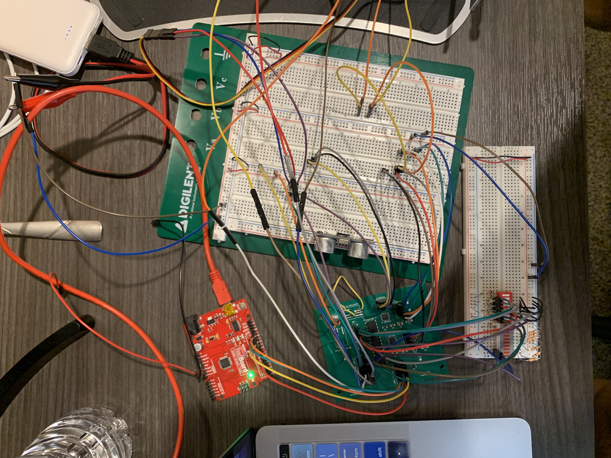
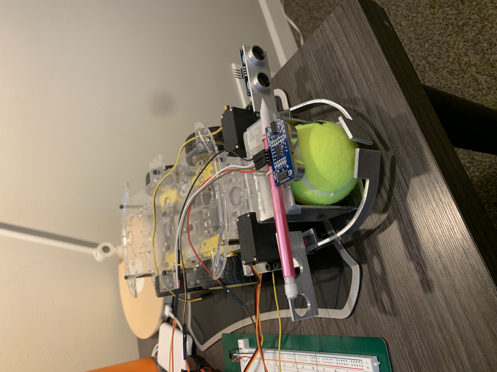

# Patrick's Notebook

# Table of contents
- [2023-02-22](#2023-02-22---Testing-power-consumption-of-DC-motors)
- [2023-02-23](#2023-02-23---Testing-of-DC-motors-with-weight)
- [2023-03-03](#2023-03-03---Redesigning-PCB)
- [2023-03-05](#2023-03-05---Checking-DC-motors-with-more-weight)
- [2023-03-11](#2023-03-11---Final-talk-with-machine-shop)
- [2023-03-15](#2023-03-15---Ultrasonic-sensor-testing)
- [2023-03-21](#2023-03-21---Testing-out-the-car-after-machine-shop-additions)
- [2023-03-22](#2023-03-22---Testing-out-the-pincer-design-with-ultrasonic-sensors)
- [2023-04-03](#2023-04-03---Final-adjustment-of-PCB-design)
- [2023-04-04](#2023-04-04---Testing-out-h-bridges)
- [2023-04-12](#2023-04-12---Programing-and-testing-the-microcontroller)
- [2023-04-17](#2023-04-17---Soldering-components-onto-our-final-PCB)
- [2023-04-21](#2023-04-21---Soldering-the-rest-of-our-components-onto-our-PCB)
- [2023-04-22](#2023-04-22---Integrating-all-the-subsystems-onto-the-car)
- [2023-04-23](#2023-04-23---Debugging-the-control-and-power-subsystems)
- [2023-04-24](#2023-04-24---Power-subsystem-problems)
- [2023-04-25](#2023-04-25---Final-Product)

# 2023-02-22 - Testing power consumption of DC motors

The goal of this session is to figure out how much current the DC motors on the car will draw at different voltages.

For this testing session, I’m just going to have the wheels suspended in the air to get a rough estimate of how much current they will take. Of course, further testing will have to be done with the wheels on the ground and with the wheels holding different weights.

The table above displays the results of current drawn from the motors based on voltage applied. As more voltage was applied to the wheels, the wheels spun faster. Current draw remained about the same throughout the whole testing process. Since the wheels were suspended in the air, we can definitely expect a higher current draw from the motors once we integrate other parts of the project.

# 2023-02-23 - Testing of DC motors with weight

The goal of this session is to test the current draw of the motors when they are given a load to carry.

I tested the current draw of the car at different weights and voltages. I also checked out the speed of the car. The hope is that we will figure out what the best voltage level would be for the motors in our final design using the data from this test.

The weights that I used varied from 50 grams all the way  to 300 grams. Combinations of these weights were used to understand the relationship between weight and current draw. The graph below displays these results.

Initially, we anticipated the DC motors to draw way more current than what our tests displayed. With this information we now have a better idea of what battery to use for the whole design.

# 2023-03-03 - Redesigning PCB

The goal of this session was to redesign the PCB based on some new information that we gathered.

First of all, we got some h-bridges that were too small to hand solder on. I think we would have even struggled to get them onto our PCB with the oven. So, we needed to find new h-bridges to use. After some researching, we decided on the DRV8848 dual h-bridges. With these, we were able to implement our design with only 3 h-bridges (each h-bridge corresponded to a pair of motors).

I also added 2 buck converters into the design. Since the DC motors worked at a reasonable speed when given 5V, we decided that regulating them at 5V would be good for both saving power and for ensuring that the image processing could keep up with the movement of the car.

The final schematic is shown below:

The h-bridges need a lot of capacitors and resistors to function so their part of the schematic looks a bit complicated. Overall, though, all components seem to be integrated properly.

# 2023-03-05 - Checking DC motors with more weight

The goal of this session is to add even more weight to the car to see just how much it can handle.

Originally, I tested the motors out with only a maximum of about 500 grams. We now anticipate a load of at least 1kg to be on the car. So, I used varying weights from 700g to 1.3kg and tested both the current draw from the motors and the speed at which the motors moved. Below is a table of my results:

The power supply that I used actually had a maximum current output of 1A. So, all current readings at 1.3kg were 1A. Nonetheless, the car was still able to operate under all of the given weights. In fact even at 6V and 1.3kg the car was moving reasonably fast.

So, with these results, we reaffirmed our decision to power the motors at 5V. Taking everything into consideration, the car should be operating at a perfect speed at this voltage level.

The image below displays the setup I used to take all the measurements. I used a breadboard to connect the DC motors to the power source available in the lab.

# 2023-03-11 - Final talk with machine shop

The goal of this session was to finalize talks with the machine shop.

The machine shop sent us an email that they wanted to finish up as many projects as they could over spring break. Because of this, I went into the shop to have one last conversation about our project. I gave them all the motors and the chassis so they could build our pincers. 

The final conclusion was that we would use a tennis ball for all testing and we would use 2 servo motors for the pincers.

# 2023-03-15 - Ultrasonic sensor testing

The goal of this session was to understand how to read the ultrasonic sensor outputs as well as understand how to operate the ultrasonic sensors.

I used an arduino UNO in order to run some code that I found online.
Here is the link to the code: https://howtomechatronics.com/tutorials/arduino/ultrasonic-sensor-hc-sr04/ 

With this code I was able to check the accuracy of the sensor (using a measuring tape) as well as write some beginner code for the microcontroller.

# 2023-03-21 - Testing out the car after machine shop additions

The goal of this session was to test out the car after the machine shop added the pincers to it.

Below is an image of what the machine shop gave us.

They gave us a cage to hold the tennis ball in addition to the pincers. This cage was actually kind of heavy so I went into the lab to do some testing with the wheel motors. I found that the car was still able to move at the 5V we originally designed to supply the motors with. However, the car is moving noticeably slower now than in previous tests. Regardless of this, the speed is good enough to meet the high level requirements and the current draw is low enough where our previous design specs would still work (the measured current draw was about 0.75A).

# 2023-03-22 - Testing out the pincer design with ultrasonic sensors

The main goal for this session was to see how the new pincers operated and to try and integrate the ultrasonic sensors with them.

Below is an image of the setup I used to test out the pincers and the sensors.

Through some research I found out that Arduino has a library dedicated for servo motors. With this discovery, we were able to remove 1 h-bridge from our PCB design, simplifying it greatly. Using this library (called Servo.h), I was able to successfully open and close the pincers. I then integrated the sensors into the design as well, placing them in a temporary location. With the code that I wrote, the pincers closed when an object was detected to be within 5cm of the ultrasonic sensor.

# 2023-04-03 - Final adjustment of PCB design

The goal of this session is to finalize the design of the PCB.

While there were a few adjustments that we had to make to the design, the overall layout of the board stayed relatively the same. The main change I made was removing the h-bridge that was connected to the servo motors. This was due to the fact that the servo motors can be operated in full by the microcontroller alone by using the Servo.h library. Apart from this, only the footprints of certain blocks were changed to match the parts that I ordered. Below is the final schematic and PCB layout:

# 2023-04-04 - Testing out h-bridges

The goal of this session was to see if we could get our code to work with the h-bridges that we chose for the design.

Since we ordered a new PCB, I only soldered one h-bridge onto our old PCB design. I then soldered some wires onto the board and connected everything together on a breadboard (this includes the connections to the DC motors). Below is an image of the setup.

Initially, nothing was working. I then noticed that some of the pins on the h-bridge were bridged together. So, after applying some flux to fix them up, I was able to get the DC motors to spin in both directions using the code that we wrote.
This session essentially confirmed that we were correctly using the h-bridges. It also gave me valuable practice with the PCB oven and with soldering.

# 2023-04-12 - Programing and testing the microcontroller

The goal of this session is to program and use the microcontroller to drive the motors.

Up to this point all of our code was tested using only an arduino UNO. Now, while the arduino UNO has the exact same microcontroller as the one that we have on our PCB, it also has some extra circuitry that can influence the performance of the code we wrote. As such, it was important for us to actually program our microcontroller and test it out with the rest of our design. Below is an image of the setup I had to both program the microcontroller and test it out with the h-bridges:

I was able to successfully program the microcontroller and got it to move the DC motors using the h-bridges. I simulated inputs into the microcontroller by using switches. With these switches I was able to validate that our code worked for both the left and right side DC motors and was able to validate that the microcontroller was looping through the code correctly.

I used the following website to program the microcontroller using the arduino UNO as an ISP: https://docs.arduino.cc/built-in-examples/arduino-isp/ArduinoISP
Programming the microcontroller was initially hard but, after going through the website a few times, I was able to upload sketches to the microcontroller with no issues.

# 2023-04-17 - Soldering components onto our final PCB
The goal of this session was to solder all of the components onto our PCB.

Using the oven, I soldered everything but the microcontroller and the header pins onto the PCB. Before soldering anything else on, I made sure to check if all of the components were correctly connected and working. I was able to confirm that everything was working except for the buck converters. After some further testing (and after taking them off and testing them on a new PCB board), I was able to confirm that the converters were fried in the oven.

Since the converters were fried, we had a big problem testing out our design. We only had access to an 11.1V battery which was way too much voltage for any of the components (we didn’t want to fry anything else). So, we were forced to immediately order new buck converters and new batteries.

# 2023-04-21 - Soldering the rest of our components onto our PCB

The goal of this session was to finish soldering the rest of the components onto our PCB.

I received the rest of the components needed today. This includes the new buck converters and the extra 5V batteries. Before soldering on the buck converters I first tested them out on a different PCB board. Once again, they didn’t want to work. No current was going through the positive V-out pin. For some reason, there was negative voltage coming out of the negative V-out pin. Due to lack of time, I couldn’t further investigate what was going on with the converters. So, instead of using the converters and the 11.1V battery, I used the backup 5V batteries that I got and bridged the voltage connections on the board with wires (replaced the placement of the converters with wires). The image below displays the test boards I used to test both the new and old buck converters:

I also finally soldered on the rest of the header pins onto the board and soldered on the microcontroller. I then tested out all of the components to make sure that they were working. The image below displays the setup I was using:

With this setup I was able to confirm that all components on the board were soldered on correctly and were not damaged. I was able to program the microcontroller with no issues. I was able to operate all h-bridges without any issues. All inputs into the board and all outputs from the board were functioning as expected.

After everything was functioning, I began to test different locations to put the ultrasonic sensors. One such location was right above where the tennis ball would be caught. This placement can be seen in the image below:

An important thing to note is that the ultrasonic sensor struggles to measure the distance between it and the ball. That is why I put it right above where the ball would go. The next series of sentences will explain the idea that I came up with. So, if the sensor is right above the ball and points right at the ground, we know that it will always have a reading of about 5-7cm. This reading will never change unless something goes between the ground and the sensor. As soon as this happens, the sensor reading will change immediately to either some really high number or some really low number. What value it changes to doesn’t matter. All that matters is that the readings from the sensor change. We can use this immediate change to tell the pincers when to close (since we are assuming that the only thing that will make it change is the ball). Doing this will make the sensors behave more like a detection system instead of having them measure distance.

# 2023-04-22 - Integrating all the subsystems onto the car

The goal of this session was to finish integrating all of the subsystems onto the car.

We had some issues the day before with combining everything. So, instead of putting everything together all at once, we systematically tested each subsystem and connected it to the car accordingly.

We started off by first confirming that the Pi was sending the correct signals to the microcontroller. After some debugging, we were able to use LEDs to confirm that all the signals were being correctly sent by the Pi. We then tested the code on the microcontroller and made sure that the pincer motors and the DC motors were running as expected when given different inputs. Once everything was confirmed to be working correctly individually (from the h-bridges to the pincer motors), we began to connect all the components together.

By the end of the day, our project was able to work partially using manual controls.

# 2023-04-23 - Debugging the control and power subsystems

Our goal was to continue integrating all of the subsystems together.

We are able to get the control subsystem to be working inconsistently with the fetching subsystem. Through some debugging with the LEDs, we found out that one of the pins on the PCB was always high. It seems that this pin was somehow connected to the reset pin which is always high in the design. Looking at the PCB, there is no clear spot on the board where this bridging takes place. We have no choice but to stop using this pin as it is keeping some of the DC motors running when they shouldn’t be.

After this pin is adjusted, the manual mode of the fetching subsystem is working without any issues.

I am now working on integrating the ultrasonic sensors into the design. In order to see the measurements that the sensor is making, I connected another arduino UNO to the output of the ultrasonic sensor. The layout I used to do this is depicted in the image below:

The black arduino UNO is the one that I am using to read the measurements from the ultrasonic sensor. The readings are super inconsistent when we try to measure the distance between the sensor and a tennis ball. I tried a few different algorithms in order to get around the inconsistencies but nothing seemed to work 100%.

# 2023-04-24 - Power subsystem problems

We tried to power our design using both a 5V usb battery as well as a 5V Pi battery. For some reason we are running into a lot of issues with this set up. After testing out a bunch of different combinations of the batteries, we found that the design worked only when powered with the Pi battery. As such, we connected the 5V pin and the GND pin from the Pi to our PCB and attached the Pi battery to the power input of the Pi.

Manual mode now works with no issues. The auto mode of our design (the mode that uses the image processing) seems to be working fairly well. The only issue we have now is that the ultrasonic sensor doesn’t want to measure the distance to the ball properly.

# 2023-04-25 - Final Product

Since we have to demo tomorrow, we are simply going to polish up all parts of the project that we managed to get working.

I attached all of our components onto the car and made sure that they were all organized neatly (wanted the design to look like a final product and not a prototype). The final car design is shown in the image below:

I did some final testing with the ultrasonic sensors so that we could have some data to display in our presentations. The graphs below are what I managed to create to display the inconsistencies we got with the sensors.

