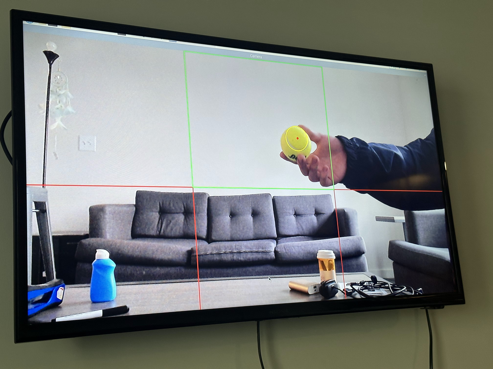

# Yinshuo's Notebook

# Table of contents
- [2023-02-14](#2023-02-14---initial-thoughts-on-devices)
- [2023-02-18](#2023-02-18---simulated-field-test-baseball)
- [2023-02-20](#2023-02-20---setup-attempt-on-camera-modules)
- [2023-02-21](#2023-02-21---attempt-for-backup-solutions)
- [2023-03-14](#2023-03-14---summary-on-pixel-detection-method)
- [2023-03-21](#2023-03-21---attempt-to-use-online-code-for-ball-detection)
- [2023-03-25](#2023-03-25---slight-modification-to-make-the-code-work)
- [2023-04-05](#2023-04-05---attempt-to-merge-other-methods)
- [2023-04-08](#2023-04-08---camera-switch)
- [2023-04-10](#2023-04-10---test-of-simplified-user-and-waypoint)
- [2023-04-20](#2023-04-20---progress-and-work-on-system-integration)
- [2023-04-23](#2023-04-23---final-attempt-on-circle-detection)

# 2023-02-14 - initial thoughts on devices

The general design and form factor of the devices requires the system is small and portable. For detection of a baseball or a volleyball which has a size about 30 to 40 centimeters in a 6 meters range, the camera should at least be able to supply a resolution of 1920 x 1080 (1080P). 

Previously I have consider using USB Cameras with optical zoom in and out lenses. Some of them has 5x optical zoom range from about 100 degrees FoV (field of view) to about 20 degrees FoV. This thoughts has been declined by the fact that the car maximum weight capacity is between 1.5Kg to 2Kg, and the weight of one such camera is at least 300 grams.

In terms of processing devices, the only reasonable options here is Raspberry Pi 4, which has approiate programming environment, computing performance, and input/output hardware. The Raspberry Pi 4 has a Broadcom BCM2711 SoC (system on chip) with quad-core Cortex-A72 CPU, runs at 1.8GHz and a 8GB RAM. Quad-core Cortex A72 has reasonable amount of performance, although fall behind today's new generation of smartphone due to it is an old architecture, and without a specific hardware ISP we could estimate about 2 to 5 frame per second for resolution of 1080P or 4k (3840 x 2160). To make the system somewhat able to work, we only need it to run at a minmum of 2 frames per second. 

For the front camera the best option is the Raspberry Pi Camera Module 3. It has 4608 x 2592 in terms of resolution, auto focus, 66 degress FoV, and 4k 30fps video which is far more than enough. A narrower FoV for the front camera is prefered so it has better focus on object and people in a long range. 
For the rear camera the best option is Raspberry Pi Camera Module 3 Wide. It has the same sensor and resolution with the Module 3 and the only difference is it has 102 degree FoV so it is suitable for rear camera, which it only needs to roughly "see" somnething. 

Both camera works with I2C protocol and should be connected to the Raspberry Pi camera port via multiplexer.

For the distance sensor, I think it is okay to use the HR SC04 ultrasonic distance sensor. It can work well from 1 meters to 5 centimeters. I used it for final project in ECE 110, and still has a few of them in my ECE 110 lab kit. It is easy to use and can also save the cost to buy new sensors as well. 

# 2023-02-18 - simulated field test baseball

While waiting for the camera modules to be on hand, I did a real field test with my camera and a baseball that should be used on the project. I brought 2 optical zoom in lenses to have the same FoV with the camera modules. 

We tested the ball from a range of 6 meters to 3 meters, and the users as well. In a similar 4000 x 3000 resolution photos, the baseball has a size big enough to be fully recognized in 66 degree FoV, and still recognizable despite being much more smaller in 102 degree FoV. 

Field Test for Camera Module 3, from Basketball Field edge

Field Test for Camera Module 3 Wide, from Basketball Field edge

# 2023-02-20 - setup attempt on camera modules

So far I have been trying to get the camera module working on Raspberry Pi, but none of them are willing to work. Here are the list of things I have tried:

Use the old Raspberry Pi camera API raspistill, but it does not work and returns a camera not found error instead.

Use the new LibCamera API, but there are multiple errors trying to install it, and there are no official answers on how to solve it.

Use a second micro SD card and install the newer version of Raspberry Pi OS. The newer system has built-in LibCamera, but the old raspistill API has been deleted as well. The LibCamera still returns camera not found error for both cameras.

Go to ECEB, and test the voltage readings on the camera module. The camera module has about 4V readings, which indicates that it is somewhat connected, but not showing up correctly.

Use the backup solution, which is USB Webcam. After install the OpenCV package and connect my old Logitech C615 webcam it could barely work, but the image quality is too bad for further processing.

Still, I have decided to use the USB Webcam since it is the only way working. The Logitech C615 can do 1080P 30fps, which 78 degree FoV. This is way lower than the previous thought 4k resolution, but might still work. 

Also, after discussion with Patrick and Louis, I figured out that baseball is too large to design a proper pincer to catch. We have to use a far smaller tennis ball with a diameter about 3 inchs. A smaller object is way harder to "see" and detect in a long range. 

# 2023-03-14 - summary on pixel detection method

The tennis ball we are using has a very unique yellow / green color, so my initial thought is to detect this color and indicates its location. 

The color pattern is that the red is about half of green/blue values, and green and blue values are about the same. So I run a double for loop on each of the pixels, filter out the underexposured ones (those one of R/G/B values are lower than 30), and decides if the red is half of green or blue and green is between the 1.1 times and 0.9 times of blue value. I tested the method for the ball under sunlight, under a better white balanced light, and a unbalanced light, and the method does work. However, the most important problem for this method is the runtime. The minmum runtime it takes is 0.5 seconds, and the maximum is 7.8 seconds, on average it takes about 3.1 seconds to process on image, which is far longer than the maximum 0.3 second in high level requirement. 

Another optimazation I can think of is to scan the image from below rather than above. The idea is that the ball is usually on the ground instead of in the sky. This method delivers better runtime, with a minmum of 0.15 second, maximum of 2.5 second, and average of 1.6 second. Still, it failed to meet the high level requirement.

(flowchart)

# 2023-03-21 - attempt to use online code for ball detection

I tried to use the same code found online at https://pyimagesearch.com/2015/09/14/ball-tracking-with-opencv/. The code works very well on my high performance desktop computers with 1080P 30fps, but on Raspberry Pi although it manages to give accurate tracking of the ball, the preview windows indicates it is way to laggy to be useable, even at a very low resolution of 400 x 300 pixels. I have to figure out how to optimize it. 

# 2023-03-25 - slight modification to make the code work

After I read through the code and considered the design requirements, I figured out that the continous video capture used in the online code is not necessary. From my real life experience with camera I know that a 4k 30fps video should cost at least 20MB of spaces each second even after H264 or H265 codec compression, but a still photo of 6000 x 4000 cost only 10MB in JPEG format. I replaced the VideoStream in the original code with capture a single frame from video at the start of each loop, and right now it is even running at least 4 fps from maximum 1080P resolution. This can satisfy the design requirement. The method works well in 2 meters range. 

To continue with the design, I borrowed the Logitech C925e USB Webcam which has same 1080P resolution and 78 degree FoV, but with better lenses and higher overall quality. 

(flowchart)

# 2023-04-05 - attempt to merge other methods

While searching for optimization related resources I found out that the Raspberry Pi GPU can be possibly used to further speed the program up, but the lack of API and documents prevent me from really implementing it. I figure out it is easier to rebuild the OpenCV package from source so it can support multiple CPU thread processing. 

The major problem with the current code is that it can not distinguish between a green tennis ball and a green envelop. The reason is that the code just color filter everything somewhat green color, calculate the maximum contour in the filtered image, and consider the biggest contour as the target. It is more unreliable considering the fact that the ball is small and it is not gonna be the maximum contour at distance. What I can thought of is that make a double check on the color filtered object, determine its shape from its contour, and only proceed when it is both green and circle. 

I searched online for computer vision method to do this, and the standard method is too calculate the number of vertices of the contour. If the number of vertices is above 5, the object will then be considered as a circle. This method works well in some situations, and in other situations it will completely mess up and giving multiple targets at the same time. 

I tested again with change_color_space_test.py, and it seems like in the real situations the image is often not properly exposured due to a lack of lighting or very bright on one side and very dark on the other side. Because of this, the masked image has discontinued contour on the target object, and because of this the simple vertices calculation method DOES NOT work. I tried to use manual exposure options offered by OpenCV, but such code does not work with Logitech Webcams. 

# 2023-04-08 - camera-switch

The design requires two camera, a front one and a rear one. Initially I thought it is possible to use both of them at once, but after do a lsusb command in terminal I realized that the Raspberry Pi has ONLY ONE USB bus, so it is technically impossible. I tried camera switch with two_camera.py, but the terminal keeps throwing me errors of unable to read the second camera positioned at 1. After doing a v4l2 --list-devices command I discovered that one Webcam is intepreted as two by Raspberry Pi. We make a multiply 2 change in camera switch code and it worked. 

# 2023-04-10 - test of simplified user and waypoint

I decided to use a blue square for waypoint and use a red triangle for users. Different with initial thoughts of use QR code for waypoint and users, the lack of resolution and long focal length camera makes a long range recognition of QR code impossible. I reused the code for ball tracking and use (100, 50, 50) and (200, 255, 255) to mask out red object, (40, 45, 80) and (121, 255, 255) to mask out blue object. The color masking method is not working perfectly, and it will switch between different objects due to lighting change.

# 2023-04-20 - progress and work on system integration

We decided to do the final system integration work at my place because my TV is the only working monitor. Patrick mentioned that the pincers are acting weird when the ball gets close, so he has to comment out all code related to ultrasonic sensors. We decided to use my spare Arduino to read the readings from the sensors by rewiring and connect in parallel. Only at this time we discovered that the reading is very inconsistent when the ball gets close. We thought this is because the ball is not flat, but trying other round object such as light bulb denied the guess. We tried other cutton objects and get simliar reading pattern as well. It seems like the cutton is absorbing sound and the echo time is thus inaccurate. We decided to use the inconsistency, when there are huge reading change in a short time then the ball is within the range. Such a method does work for 10 centimeters but not work for 5 centimeters because the pincers can only catch something within 6 centimeters.

To make the controls more subtle, we decided to further split the region from 6 to 18, so there will be 3 sublines for middle part. However, this caused the image processing to drop below 2 fps minmum requirement, so we have to roll back. 

I helped rewiring to a smaller breadboard and mount everything ready to go. I also come up with the idea to the small cooling fan in ECE 110 kit to help the processor cools down and avoid restart. 

# 2023-04-23 - final attempt on circle detection

On the nights before final demo I finally have some better ideas of shape detection. I found Hough Circle Transform which detects the direct shape of a circle instead of counting vertices. The method works way much better, and combining with color masking it still gives 3 meters of detection range and the ability to distinguish envelop and ball. However, there are no time left to further testing the method and merge it into our final design.

I adjusted the color masking for waypoint and user. It is now (78,158,124) and (130, 250, 255) for waypoint, (140, 70, 70) and (179, 255, 255) for user. I also added auto white balance options to the code to deal with different lighting conditions. 

